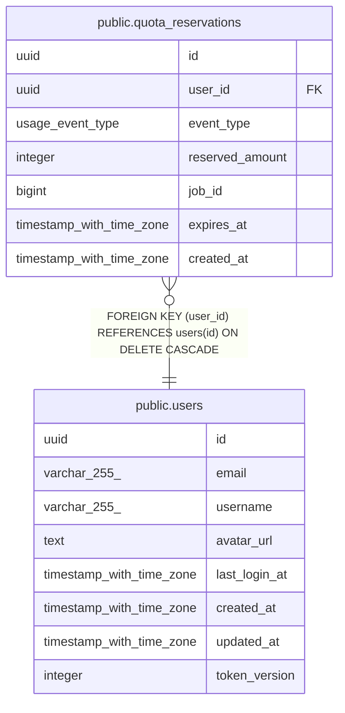

# public.quota_reservations

## Description

## Columns

| Name            | Type                     | Default                        | Nullable | Children | Parents                         | Comment |
| --------------- | ------------------------ | ------------------------------ | -------- | -------- | ------------------------------- | ------- |
| id              | uuid                     | gen_random_uuid()              | false    |          |                                 |         |
| user_id         | uuid                     |                                | false    |          | [public.users](public.users.md) |         |
| event_type      | usage_event_type         |                                | false    |          |                                 |         |
| reserved_amount | integer                  |                                | false    |          |                                 |         |
| job_id          | bigint                   |                                | false    |          |                                 |         |
| expires_at      | timestamp with time zone | (now() + '01:00:00'::interval) | false    |          |                                 |         |
| created_at      | timestamp with time zone | now()                          | false    |          |                                 |         |

## Constraints

| Name                         | Type        | Definition                                                   |
| ---------------------------- | ----------- | ------------------------------------------------------------ |
| chk_reserved_amount_positive | CHECK       | CHECK ((reserved_amount > 0))                                |
| fk_quota_reservations_user   | FOREIGN KEY | FOREIGN KEY (user_id) REFERENCES users(id) ON DELETE CASCADE |
| quota_reservations_pkey      | PRIMARY KEY | PRIMARY KEY (id)                                             |
| uq_quota_reservations_job_id | UNIQUE      | UNIQUE (job_id)                                              |

## Indexes

| Name                              | Definition                                                                                                    |
| --------------------------------- | ------------------------------------------------------------------------------------------------------------- |
| quota_reservations_pkey           | CREATE UNIQUE INDEX quota_reservations_pkey ON public.quota_reservations USING btree (id)                     |
| uq_quota_reservations_job_id      | CREATE UNIQUE INDEX uq_quota_reservations_job_id ON public.quota_reservations USING btree (job_id)            |
| idx_quota_reservations_expires    | CREATE INDEX idx_quota_reservations_expires ON public.quota_reservations USING btree (expires_at)             |
| idx_quota_reservations_user_event | CREATE INDEX idx_quota_reservations_user_event ON public.quota_reservations USING btree (user_id, event_type) |

## Relations

---

> Generated by [tbls](https://github.com/k1LoW/tbls)
